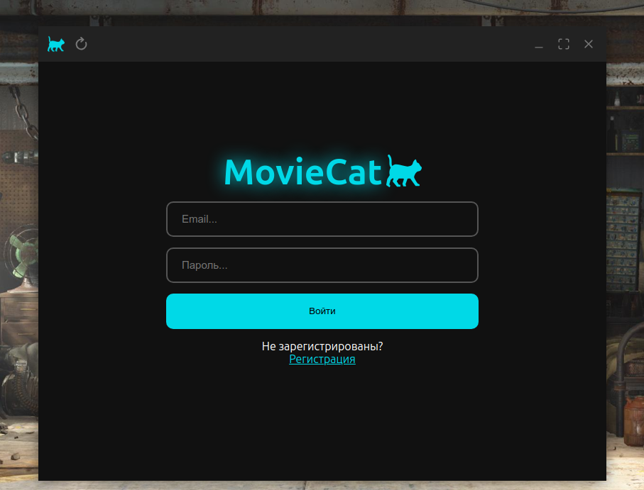
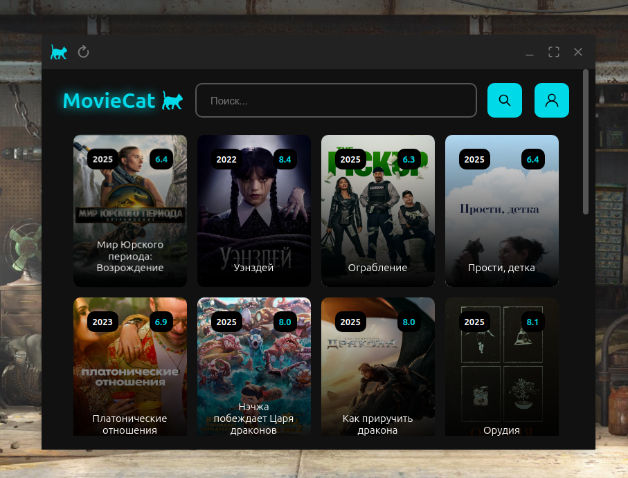
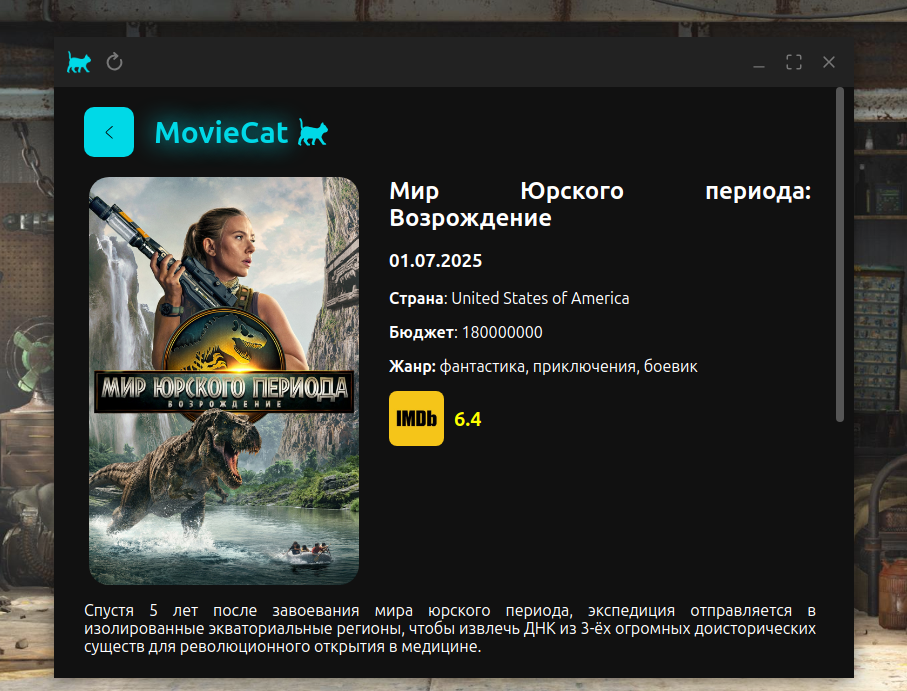

# 🎬 Moviecat

> Десктоп версия [интерактивного веб-приложения для поиска и просмотра фильмов и сериалов онлайн](https://moviecat.eagle.com.ru/).

## ✨ Демонстрация

🌐 [Скачать приложение под Windows и Linux](https://github.com/NikolasEagle/moviecat-desktop/releases)

## 📖 Описание проекта

> Данный проект предоставляет пользователям возможность просмотра и поиска фильмов и сериалов онлайн. Проект был создан для того, чтобы попрактиковаться в работе с React, Node.js, TypeScript, Express, Docker и Electron.

## 🛠️ Технологии и Стек

| Технология | Описание                                                                               |
| ---------- | -------------------------------------------------------------------------------------- |
| Electron   | Фреймворк для разработки десктопных приложений с использованием HTML, CSS и JavaScript |
| React      | UI библиотека для построения интерфейса                                                |
| Node.js    | Серверная часть                                                                        |
| Express    | Легкий серверный фреймворк                                                             |
| PostgreSQL | База данных пользователей                                                              |
| Redis      | Хранилище сессий в формате ключ:значение                                               |
| Kubernetes | Оркестрация контейнеров |
| Helm | Менеджер пакетов для Kubernetes |

## 📷 Скриншоты

## ✍️ Автор

- [@NikolasEagle](https://github.com/NikolasEagle)
- Telegram: [https://t.me/EglPC](https://t.me/EglPC)
